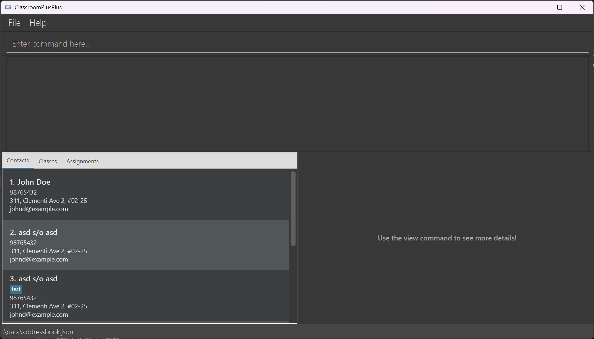

# Classroom Plus Plus (CPP)

 
<em>Image: AB3 Screenshot edited with Gemini to include “Contacts”, “Classes” and “Assignments” tabs to match CPP functionalities</em>

Classroom Plus Plus (CPP) is a powerful Command Line Interface (CLI) tool designed specifically for educators
who prefer typing over graphical user interfaces to streamline class contact management and assignment tracking.

Managing hundreds of students' contact details and assignments can be a daunting task for educators.
CPP simplifies this process by providing an intuitive interface to store and organise student information efficiently.
With CPP, educators can easily add, edit, and search for contacts, classes and assignments, ensuring that they have quick access to important information when needed.

## Key Features

* **Contact Management**: Store and manage student contact details, including names, phone numbers, email addresses, and more.
* **Class Organisation**: Group students into classes for better organisation and easy access to class-specific information.
* **Assignment Tracking**: Keep track of student assignments, deadlines in one convenient location.
* **Quick Access with Fuzzy Search**: Find details quickly using fuzzy search, even with partial or misspelled queries.
* **CLI Interface**: Interact with CPP through a command-line interface, allowing for quick and efficient management of contacts and assignments.

For the detailed documentation of this project, see the **[CPP Product Website](https://ay2526s2-cs2103t-t10-1.github.io/tp/)**.

## Acknowledgements

* This project is based on the AddressBook-Level3 project created by the [SE-EDU initiative](https://se-education.org).
