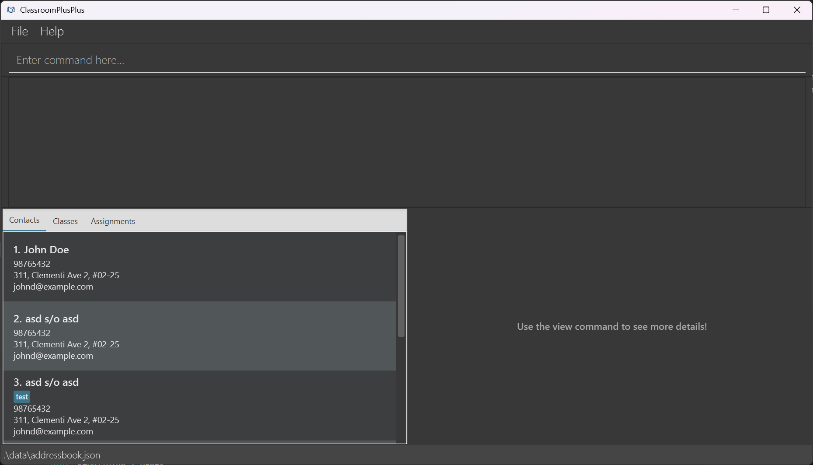
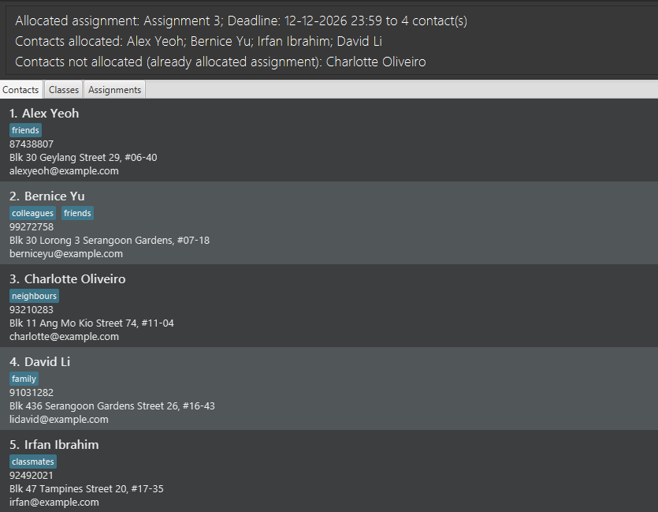
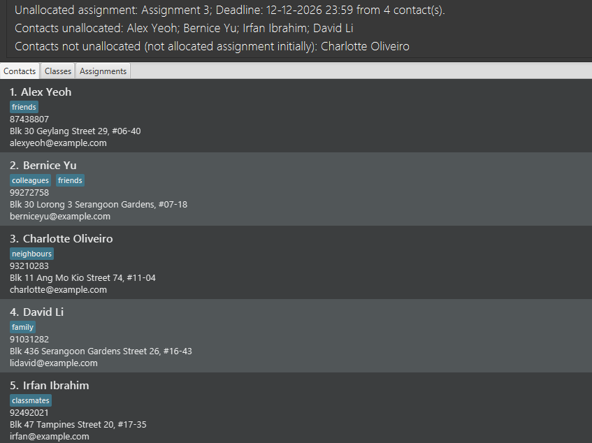

<div class="user-guide">

# Classroom Plus Plus (CPP) User Guide

Classroom Plus Plus (CPP) is a desktop application designed for educators to manage student and staff contact information, classes, and assignment tracking from a single, centralized place. CPP combines a simple Graphical User Interface (GUI) with a powerful Command-Line Interface (CLI) so teachers can work quickly and reliably.

**Who this guide is for**

* **Primary users:** Primary and secondary school teachers and tutors who manage classes and student records.

* **Assumed skills:** Basic computer literacy, and comfortable using a CLI. No prior experience with Java or software development is required.

**How to use this guide**

* Use the [**Quick start**](#quick-start) section to install and run the app fast.

* Use [**Features**](#features) to view the full list of features, command reference, and examples.

* Use [**FAQ**](#faq) and [**Known issues**](#known-issues-and-workarounds) when troubleshooting.

* Refer to the [**Command summary**](#command-summary) for a quick reference of all commands and formats.

* Use the page navigation at the side to jump between sections.

--------------------------------------------------------------------------------------------------------------------

## Table of contents

* [Quick start](#quick-start)
* [Features](#features)
* [FAQ](#faq)
* [Planned features and future work](#planned-features-and-future-work)
* [Known issues and workarounds](#known-issues-and-workarounds)
* [Command summary](#command-summary)

--------------------------------------------------------------------------------------------------------------------

## Quick start

This quick start assumes you are a teacher who wants to install CPP, open the application, and run a few common commands to manage your contacts, classes, and assignments. Follow the short steps below, then consult [**Features**](#features) for full command details.

### Prerequisites

* Minimum disk space: `500 MB` for app + data. Please refer to the section on [**How to check available disk space**](#how-to-check-available-disk-space) to ensure you have enough free space.

* Java 17 or newer must be installed and available on your PATH (system environment variables). If you are unfamiliar with setting up your PATH or checking your current version, do not worry - just head over to the [**How to check and install Java**](#how-to-check-and-install-java) section for a quick walkthrough.

* If your system meets the above requirements, you may proceed to the section on [**Install and run**](#install-and-run) to download the application and try out some commands.

#### How to check available disk space

<box type="info">As a reference, 1 TB = 1048576 MB, 1 GB = 1024 MB.</box>

**Windows:**

1. Open File Explorer and navigate to **"This PC"** or **"My Computer"**.

1. Look for the drive where you plan to store the app home (e.g., `C:\` or `D:\`).

1. Check the **"Free space"** column for that drive to ensure it has at least `500MB` free.

1. If you have enough free space, you may proceed to check the Java version as described in the next section [**How to check and install Java**](#how-to-check-and-install-java).

**macOS:**

1. Click on the Apple menu and select "System Settings".

1. Go to "General" in the left sidebar.

1. Click on "Storage".

1. Check the available space for the drive where you plan to store the app home (e.g., Macintosh HD) to ensure it has at least `500MB` free.

1. If you have enough free space, you may proceed to check the Java version as described in the next section [**How to check and install Java**](#how-to-check-and-install-java).

#### How to check and install Java

**Windows:**

1. Open Command Prompt or PowerShell by searching for it in the Windows Search Bar.

1. To check Java from Command Prompt or PowerShell, run `java -version`.

1. If Java is installed, you should see output showing the Java version (e.g., `java version "17.0.1"`).
    <box type="info">Any version that is 17.0.0 or newer is acceptable.</box>
    <box type="warning">Older versions (e.g., Java 8) will not work and must be updated using Step 4.</box>
    <box type="warning">If you see an error like 'java' is not recognized, it means Java is not installed. Please follow Step 4 to install Java.</box>

    

1. If Java is not found, you may refer to the [Windows guide](https://se-education.org/guides/tutorials/javaInstallationWindows.html) to install Java 17.

1. Once Java is installed, repeat Steps 1-3 to verify the installation.

**macOS:**

1. Open Terminal by pressing `Cmd + Space` to open Spotlight, then type "Terminal" and press Enter.

1. Run the following command to check your Java version:
   `java -version`

1. If Java is installed, you should see output showing the Java version (e.g., `java version "17"`).
    <box type="info">Any version that is 17 or newer is acceptable.</box>
    <box type="warning">Older versions (e.g., Java 8) will not work and must be updated using Step 4.</box>
    <box type="warning">If you see an error like `zsh: command not found: java`, it means Java is not installed. Please follow Step 4 to install Java.</box>

    
    <p style="font-size: 0.9em; color: #666; text-align: center; margin-top: 0;">(Source: tutorials24x7)</p>

1. If Java is not found, you may refer to the [macOS guide](https://se-education.org/guides/tutorials/javaInstallationMac.html) to install Java 17.

1. Once Java is installed, repeat Steps 1-3 to verify the installation.

### Install and run

1. Download the latest `cpp.jar` from the project [release page](https://github.com/AY2526S2-CS2103T-T10-1/tp/releases).

1. Move it to a folder that you will use as the app home.
    <box type="info">A subfolder "data/" and a file "preferences.json" will both be created in this folder.</box>

1. Users are **strongly encouraged to create a dedicated folder for CPP** (e.g., `Documents/CPP`) rather than running the `cpp.jar` file from a temporary download folder to prevent the accidental deletion of data files.

1. Open the folder where you saved `cpp.jar`, right click on an empty space in the folder and select **"Open in Terminal" (macOS)** or **"Open Command Prompt here" (Windows)**.
   <box type="info">On later versions of Windows, you may also see "Open in Terminal" which is also fine.</box>

1. To launch the app, type in the following command and press Enter:

    ```bash
    java -jar cpp.jar
    ```

\
Within a few seconds the application will appear. The main User Interface (UI) contains from top to bottom:

* A command box to enter CLI commands.

* A result display that shows the output of commands and brief success/error messages.

* A central list panel with a toggle to show contacts, classes, or assignments.

    <box type="info">The app will automatically load some default contacts on first launch.</box>



### Quick CLI tutorial (common tasks and expected output)

In this quick tutorial, we will cover some common tasks such as listing contacts, adding a contact, deleting contacts, and finding contacts by name keywords. The expected output shown is based on the default data loaded on first launch. Do paste the commands given in the application's command box and check that the result display and list panel match the expected output given before proceeding to the next command.

<box type="tip" seamless>

**Tips:**

* Do not attempt to copy multiple commands at once. Copy and paste one command at a time, and wait for the result display to show the confirmation message before pasting the next command.

* Use `help` in the command box for a quick list of commands: `help`.

* If you are unsure of the command format, you may enter the command with incomplete parameters (e.g., `addcontact n/John Doe`) and the app will show an error message with the correct usage.

* Refer to the [**Features**](#features) section for advanced features with the full command format, options and advanced examples.

</box>

* **List all contacts:**

    Command:

    ```text
    list contacts
    ```

    Expected: Displays a numbered list of contacts in the main panel.

    ```text
    Listed all contacts
    ```

* **Add a contact John Doe with phone, email, address and tags:**

    Command:

    ```text
    addcontact n/John Doe p/98765432 e/johnd@example.com a/311, Clementi Ave 2 t/TransferStudent t/FinancialAid
    ```

    Expected: Confirmation message in result display and new contact appears in the list.

    ```text
    New contact added: John Doe; Phone: 98765432; Email: johnd@example.com; Address: 311, Clementi Ave 2; Tags: [TransferStudent][FinancialAid]
    ```

* **Delete the 1st, 2nd and 3rd contact in the list:**

    Command:

    ```text
    delete ct/1 2 3
    ```

    Expected: Confirmation message in result display and contact list updated with the deleted contact removed.

    ```text
    Deleted Contact: Alice Yeoh; Phone: 87438807; Email: alexyeoh@example.com; Address: Blk 30 Geylang Street 29, #06-40; Tags: [friends]
    Deleted Contact: Bernice Yu; Phone: 99272758; Email: berniceyu@example.com; Address: Blk 30 Lorong 3 Serangoon Gardens, #07-18; Tags: [colleagues][friends]
    Deleted Contact: Charlotte Oliveiro; Phone: 93210283; Email: charlotte@example.com; Address: Blk 11 Ang Mo Kio Street 74, #11-04; Tags: [neighbours]
    ```

* **Find by name keywords (case-insensitive):**

    Command:

    ```text
    findcontact dAviD IRFAN
    ```

    Expected: Confirmation message in result display and contact list updated to show only David Li and Irfan Ibrahim.

    ```text
    2 contacts listed!
    ```

<box type="warning" seamless>

**Warnings:**

* Back up your data folder (`data/addressbook.json`) before manual edits. A corrupted `addressbook.json` will cause the app to start with an empty dataset.

* The app prevents duplicate names within the same category. While an assignment and a class can share the same name, you cannot have two assignments, two classes, or two contacts with identical names. CPP will reject any duplicate entry within a domain with an explanatory error.

</box>

--------------------------------------------------------------------------------------------------------------------

## Features

<box type="info" seamless>

**Notes about the command format:**<br>

* Words in `UPPER_CASE` are the parameters to be supplied by the user.<br>
  e.g. in `addcontact n/CONTACT_NAME`, `CONTACT_NAME` is a parameter which can be used as `addcontact n/John Doe`.

* Items in square brackets are optional.<br>
  e.g `n/CONTACT_NAME [t/TAG]...` can be used as `n/John Doe t/friend` or as `n/John Doe`.

* Items with `...` after them can be used multiple times.<br>
  e.g. `[t/TAG]...` can be used as ` ` (i.e. 0 times), `t/friend`, `t/friend t/family` etc.<br>
  e.g. `ct/CONTACT_INDICES...` can be used as `ct/1`, `ct/1 2 3`, `ct/1 3 5 7` etc.

* Parameters can be in any order.<br>
  e.g. if the command specifies `n/CONTACT_NAME p/PHONE_NUMBER`, `p/PHONE_NUMBER n/CONTACT_NAME` is also acceptable.

* Extraneous parameters for commands that do not take in parameters (such as `help`, `exit`, and `clear`) will be ignored.<br>
  e.g. if the command specifies `help 123`, it will be interpreted as `help`.

* If you are using a PDF version of this document, be careful when copying and pasting commands that span multiple lines as space characters surrounding line-breaks may be omitted when copied over to the application.
</box>

### Viewing help : `help`

Shows a message explaining how to access the help page.


**Format:** `help`

### Adding a contact: `addcontact`

Adds a contact to the address book.

**Format:** `addcontact n/CONTACT_NAME p/PHONE_NUMBER e/EMAIL a/ADDRESS [c/CLASS_NAME] [ass/ASSIGNMENT_NAME] [t/TAG]...`

* Creates a contact with the specified `CONTACT_NAME`, `PHONE_NUMBER`, `EMAIL` and `ADDRESS`.

* The `CONTACT_NAME` provided must only contain alphanumeric characters and spaces. It cannot be blank.

* The `CONTACT_NAME` must be unique across all contacts (case-insensitive).

* The `PHONE_NUMBER` provided must only contain numeric digits (0-9), be a minimum of 3 digits long, and cannot be blank.

* The `EMAIL` provided must be in the format `local-part@domain`.

  * The local part can contain alphanumeric characters and special characters (`+`, `.`, `-`), but cannot start or end with special characters.

  * The domain must contain at least one period, each label must be alphanumeric with optional hyphens between characters, and the top-level domain must be at least 2 characters long. No spaces allowed, and cannot be blank.

* The `ADDRESS` provided can contain any characters, and cannot be blank.

* `c/CLASS_NAME` is optional and can be used to allocate the specified class to the contact. If the `c/` prefix is included, the `CLASS_NAME` must match the name of an existing class (case-insensitive).

* `ass/ASSIGNMENT_NAME` is optional and can be used to allocate the specified assignment to the contact. If the `ass/` prefix is included, the `ASSIGNMENT_NAME` must match the name of an existing assignment (case-insensitive).

* `t/TAG` is optional and can be used to add tags to the contact. Each `TAG` must be a single alphanumeric word (no spaces), and tags are case-sensitive.

* If multiple instances of the same tag are provided, the command still succeeds, but only one instance of that tag is added.

<box type="warning" seamless>

**Warnings:**

* If the specified class or assignment does not exist, the command will fail and no contact is created.

* If any of the parameters are invalid, the command will also fail and no contact is created.

</box>

<box type="tip" seamless>

**Tip:** A contact can have any number of tags (including 0)
</box>

**Examples:**

* `addcontact n/Betsy Crowe e/betsycrowe@example.com a/Betsy Street, Block 123, #06-07 p/1234567` <br>
  Creates a contact with the name "Betsy Crowe", phone number "1234567", email "betsycrowe<span></span>@example.com", address "Betsy Street, Block 123, #06-07"

* `addcontact n/John Doe p/98765432 e/johnd@example.com a/311, Clementi Ave 2, #02-25 c/CS2103T T10 1 ass/Assignment 1 t/friends t/owesMoney`<br>
  Creates a contact with the name "John Doe", phone number "98765432", email "johnd<span></span>@example.com", address "311, Clementi Ave 2, #02-25", allocated to class group "CS2103T T10 1" and assignment "Assignment 1", with tags "friends" and "owesMoney".

  [IMAGE TO BE ADDED]

### Adding classes: `addclass`

Adds a class to the address book.

**Format:** `addclass c/CLASS_NAME [ct/CONTACT_INDICES...]`

* Creates a class with the specified `CLASS_NAME`. The `CLASS_NAME` must only contain alphanumeric characters and spaces. It cannot be blank, must be unique, and should not match the name of any existing class (case-insensitive).

* `ct/CONTACT_INDICES...` is optional and can be used to allocate the class to specific contacts upon creation. If the `ct/` prefix is included, at least 1 contact index must be specified.

* These `CONTACT_INDICES...` must contain 1 or more positive integers 1, 2, 3, ..., referring to the index number shown in the displayed contact list.

<box type="warning" seamless>

**Warnings:**

* If any of the specified contacts do not exist, the command will fail and no class is created.

* If any of the parameters are invalid, the command will also fail and no class is created.

* The contact indices specified refer to the currently displayed contact list after filtering (e.g., after a `findcontact` command). It is recommended to run `list contacts` before this command to ensure the correct contact indices are used.

</box>

**Examples:**

* `addclass c/CS2103T T10 1`<br>
  Creates a class with the name "CS2103T T10 1".

* `list contacts` followed by `addclass c/CS2103T T10 1 ct/1 2 3`<br>
  Creates a class with the name "CS2103T T10 1" allocated to the 1st, 2nd, and 3rd contacts.

  [IMAGE TO BE ADDED]

### Allocating classes to contacts: `allocclass`

Allocates a class to specific contacts.

**Format:** `allocclass c/CLASS_NAME ct/CONTACT_INDICES...`

* The `CLASS_NAME` must match the name of an existing class (case-insensitive).

* These `CONTACT_INDICES...` must contain 1 or more positive integers 1, 2, 3, ..., referring to the index number shown in the displayed contact list.

<box type="warning" seamless>

**Warnings:**

* If any of the specified contacts or class do not exist, the command will fail and no allocation is done.

* If any of the parameters are invalid, the command will also fail and no allocation is done.

* The contact indices specified refer to the currently displayed contact list after filtering (e.g., after a `findcontact` command). It is recommended to run `list contacts` before this command to ensure the correct contact indices are used.

* Reallocating a class to a contact that already belongs to that class will not cause any changes to the contact's class memberships. However, if no successful allocations are performed at the end of the command, the command will fail and the user will see an error message specifying the issue.

* Allocating a class does not automatically include its assignments, as these are tracked individually by contact. The “allocate by class” feature is designed as a time-saver to help you update several contacts simultaneously. You will need to additionally use the `allocass` command to allocate specific assignments to the contact if needed.

</box>

**Examples:**

* `list contacts` followed by `allocclass c/CS2103T T10 1 ct/1`<br>
  Allocates the class "CS2103T T10 1" to only the 1st contact in the list.

* `list contacts` followed by `allocclass c/CS2103T T10 1 ct/1 2 3`<br>
  Allocates the class "CS2103T T10 1" to the 1st, 2nd, and 3rd contacts in the list.

  [IMAGE TO BE ADDED]

### Unallocating classes from contacts: `unallocclass`

Unallocates a class from specific contacts.

**Format:** `unallocclass c/CLASS_NAME ct/CONTACT_INDICES...`

* The `CLASS_NAME` must match the name of an existing class (case-insensitive).

* These `CONTACT_INDICES...` must contain 1 or more positive integers 1, 2, 3, ..., referring to the index number shown in the displayed contact list.

<box type="warning" seamless>

**Warnings:**

* If any of the specified contacts or class do not exist, the command will fail and no allocation is done.

* If any of the parameters are invalid, the command will also fail and no allocation is done.

* The contact indices specified refer to the currently displayed contact list after filtering (e.g., after a `findcontact` command). It is recommended to run `list contacts` before this command to ensure the correct contact indices are used.

* Unallocating a class from a contact that does not belong to that class will not cause any changes to the contact's class memberships. However, if no successful unallocations are performed at the end of the command, the command will fail and the user will see an error message specifying the issue.

* Unallocating a class from a contact does not automatically include unallocating its assignments, as these are tracked individually by contact. The “unallocate by class” feature is designed as a time-saver to help you update several contacts simultaneously. You will need to additionally use the `unallocass` command to unallocate specific assignments from the contact if needed.

</box>

**Examples:**

* `list contacts` followed by `unallocclass c/CS2103T T10 1 ct/1`<br>
  Unallocates the class "CS2103T T10 1" from only the 1st contact in the list.

* `list contacts` followed by `unallocclass c/CS2103T T10 1 ct/1 2 3`<br>
  Unallocates the class "CS2103T T10 1" from the 1st, 2nd, and 3rd contacts in the list.

  [IMAGE TO BE ADDED]

### Adding assignments: `addass`

Adds an assignment to the address book.

**Format:** `addass ass/ASSIGNMENT_NAME d/DEADLINE [c/CLASS_NAME] [ct/CONTACT_INDICES...]`

* Creates an assignment with the specified `ASSIGNMENT_NAME` and `DEADLINE`.

* The `ASSIGNMENT_NAME` must only contain alphanumeric characters and spaces. It cannot be blank, must be unique, and should not match the name of any existing assignment (case-insensitive).

* The `DEADLINE` provided must be in the format `dd-MM-yyyy HH:mm`.

* `c/CLASS_NAME` is optional and can be used to allocate the assignment to all contacts in that class. If the `c/` prefix is included, the `CLASS_NAME` must match the name of an existing class (case-insensitive).

* `ct/CONTACT_INDICES...` is optional and can be used to allocate the assignment to specific contacts. If the `ct/` prefix is included, at least 1 contact index must be specified.

* These `CONTACT_INDICES...` must be positive integers 1, 2, 3, ..., referring to the index number shown in the displayed contact list.

<box type="warning" seamless>

**Warnings:**

* If any of the specified contacts or classes do not exist, the command will fail and no assignment is created.

* If any of the other parameters are invalid, the command will also fail and no assignment is created.

* The contact indices specified refer to the currently displayed contact list after filtering (e.g., after a `findcontact` command). It is recommended to run `list contacts` before this command to ensure the correct contact indices are used.

* If the specified class does not contain any students, the command will fail and no assignment is created.

* The deadline stored in `addressbook.json` is in GMT. Any direct modifications to `addressbook.json` must ensure that date and time values are in GMT, otherwise the user will see incorrect deadlines in the app and may encounter issues when trying to update submission statuses or grading information for those assignments.

</box>

<box type="tip" seamless>

**Tips:**

* You can enter both the `c/CLASS_NAME` and `ct/CONTACT_INDICES...` parameters to allocate the assignment to specific contacts at the time of creation. This is optional and can also be done later using the `allocass` command.

* The deadline will be based on the timezone set in `preferences.json`. By default, this is set to GMT +8, but you can change it to your local timezone if needed. Acceptable values range from -18 to 18, and any invalid or missing timezone values will default to GMT +8.

</box>

**Examples:**

* `addass ass/Assignment 1 d/01-12-2023 23:59`<br>
  Creates an assignment with the name "Assignment 1" and deadline "1 Dec 2023 11.59pm".

* `addass ass/Assignment 2 d/15-12-2023 23:59 c/CS2103T T10 1`<br>
  Creates an assignment with the name "Assignment 2" and deadline "15 Dec 2023 11.59pm", allocated to all contacts belonging to class "CS2103T T10 1".

* `list contacts` followed by `addass ass/Assignment 3 d/30-12-2023 23:59 ct/1 2 3`<br>
  Creates an assignment with the name "Assignment 3" and deadline "30 Dec 2023 11.59pm", allocated to the 1st, 2nd, and 3rd contacts in the list.

* `list contacts` followed by `addass ass/Assignment 4 d/15-01-2024 23:59 c/CS2103T T10 1 ct/4 5`<br>
  Creates an assignment with the name "Assignment 4" and deadline "15 Jan 2024 11.59pm", allocated to the 4th and 5th contacts in the list, as well as all contacts belonging to class "CS2103T T10 1".

  The screenshot below illustrates the last example, where the class "CS2103T T10 1" consists of contacts 2-5.\
  

### Allocating assignments to contacts: `allocass`

Allocates an assignment to specific contacts.

**Format:** `allocass ass/ASSIGNMENT_NAME [c/CLASS_NAME] [ct/CONTACT_INDICES...]`

* Allocates the assignment to the specified contacts, as well as all contacts in the specified class.

* The `ASSIGNMENT_NAME` must match the name of an existing assignment (case-insensitive).

* At least 1 of `[c/CLASS_NAME]` or `[ct/CONTACT_INDICES...]` must be provided.

* The `CLASS_NAME` must match the name of an existing class (case-insensitive).

* The `CONTACT_INDICES...` must contain 1 or more positive integers 1, 2, 3, ..., referring to the index number shown in the displayed contact list.

<box type="warning" seamless>

**Warnings:**

* If any of the specified contacts or classes do not exist, the command will fail and no allocation is done.

* If any of the parameters are invalid, the command will also fail and no allocation is done.

* The contact indices specified refer to the currently displayed contact list after filtering (e.g., after a `findcontact` command). It is recommended to run `list contacts` before this command to ensure the correct contact indices are used.

* If the specified class does not contain any students, the command will fail and no allocation is done.

* If no contacts are allocated at the end of the command, the command will fail and the user will see an error message specifying the issue.

</box>

<box type="tip" seamless>

**Tip:** You can enter both the `c/CLASS_NAME` and `ct/CONTACT_INDICES...` parameters to allocate the assignment to more contacts at the same time.

</box>

**Examples:**

* `allocass ass/Assignment 1 ct/1 2 3`<br>
  Allocates the "Assignment 1" to the 1st, 2nd, and 3rd contacts in the list.

* `allocass ass/Assignment 2 c/CS2103T T10 1`<br>
  Allocates the "Assignment 2" to all contacts in the "CS2103T T10 1" class.

* `allocass ass/Assignment 3 c/CS2103T T10 1 ct/1 2 3`<br>
  Allocates the "Assignment 3" to the 1st, 2nd, and 3rd contacts in the list, as well as all contacts belonging to class "CS2103T T10 1".

  The screenshot below illustrates the last example, where the class "CS2103T T10 1" contains contacts 2-5, and contact 3 was already allocated the assignment.<br>
  

### Unallocating assignments from contacts: `unallocass`

Unallocates an assignment from specific contacts.

**Format:** `unallocass ass/ASSIGNMENT_NAME [c/CLASS_NAME] [ct/CONTACT_INDICES...]`

* Unallocates the assignment from the specified contacts, as well as all contacts in the specified class.

* The `ASSIGNMENT_NAME` must match the name of an existing assignment (case-insensitive).

* At least 1 of `[c/CLASS_NAME]` or `[ct/CONTACT_INDICES...]` must be provided.

* The `CLASS_NAME` must match the name of an existing class (case-insensitive).

* The `CONTACT_INDICES...` must contain 1 or more positive integers 1, 2, 3, ..., referring to the index number shown in the displayed contact list.

<box type="warning" seamless>

**Warnings:**

* If any of the specified contacts or classes do not exist, the command will fail and no unallocation is done.

* If any of the parameters are invalid, the command will also fail and no unallocation is done.

* The contact indices specified refer to the currently displayed contact list after filtering (e.g., after a `findcontact` command). It is recommended to run `list contacts` before this command to ensure the correct contact indices are used.

* If the specified class does not contain any students, the command will fail and no unallocation is done.

* If no contacts are unallocated at the end of the command, the command will fail and the user will see an error message specifying the issue.

</box>

<box type="tip" seamless>

**Tip:** You can enter both the `c/CLASS_NAME` and `ct/CONTACT_INDICES...` parameters to unallocate the assignment from more contacts at the same time.

</box>

**Examples:**

* `unallocass ass/Assignment 1 ct/1 2 3`<br>
  Unallocates the "Assignment 1" from the 1st, 2nd, and 3rd contacts in the list.

* `unallocass ass/Assignment 2 c/CS2103T T10 1`<br>
  Unallocates the "Assignment 2" from all contacts in the "CS2103T T10 1" class.

* `unallocass ass/Assignment 3 c/CS2103T T10 1 ct/1 2 3`<br>
  Unallocates the "Assignment 3" from the 1st, 2nd, and 3rd contacts in the list, as well as all contacts belonging to class "CS2103T T10 1".

  The screenshot below illustrates the last example, where the class "CS2103T T10 1" contains contacts 2-5, and only contacts 1, 2, 4, and 5 had the assignment allocated.<br>
  

### Marking assignments as submitted for contacts: `submit`

Marks a specific assignment as submitted for the specified contacts.

**Format:** `submit ass/ASSIGNMENT_NAME [c/CLASS_NAME] [ct/CONTACT_INDICES...] [d/SUBMISSION_DATE]`

* Marks the assignment as submitted for the specified contacts, as well as all contacts in the specified class.

* If the assignment is already submitted for the specified contact, the submission status and submission date will not be updated.

* The `ASSIGNMENT_NAME` must match the name of an existing assignment (case-insensitive).

* At least 1 of `[c/CLASS_NAME]` or `[ct/CONTACT_INDICES...]` must be provided.

* The `CLASS_NAME` must match the name of an existing class (case-insensitive).

* The `CONTACT_INDICES...` must contain 1 or more positive integers 1, 2, 3, ..., referring to the index number shown in the displayed contact list.

* The `SUBMISSION_DATE` must be in the format `dd-MM-yyyy HH:mm` and refer to a valid date before the current date and time.

<box type="warning" seamless>

**Warnings:**

* If any of the specified contacts or classes do not exist, the command will fail and no assignments will be marked as submitted.

* If any of the parameters are invalid, the command will also fail and no assignments will be marked as submitted.

* The contact indices specified refer to the currently displayed contact list after filtering (e.g., after a `findcontact` command). It is recommended to run `list contacts` before this command to ensure the correct contact indices are used.

* If the specified class does not contain any students, the command will fail and no assignments will be marked as submitted.

* If no contacts are marked as submitted at the end of the command, the command will fail and the user will see an error message specifying the issue.

* The submission date and time stored in `addressbook.json` is in GMT. Any direct modifications to `addressbook.json` must ensure that date and time values are in GMT, otherwise the user will see incorrect submission dates in the app and may encounter issues when trying to update submission statuses or grading information for those assignments.

* It is recommended to use the `submit` command to mark assignments as submitted, as the app will automatically convert the specified submission date and time from the user's local timezone to GMT before storing it in `addressbook.json`.

</box>

<box type="tip" seamless>

**Tips:**

* You may omit the `d/SUBMISSION_DATE` parameter to use the current date and time as the submission date.

* The submission date and time will be based on the timezone set in `preferences.json`. By default, this is set to GMT +8, but you can change it to your local timezone if needed. Acceptable values range from -18 to 18, and any invalid or missing timezone values will default to GMT +8.

</box>

**Examples:**

* `submit ass/Assignment 1 ct/1 2 3`<br>
  Marks "Assignment 1" as submitted for the 1st, 2nd, and 3rd contacts in the list.

* `submit ass/Assignment 2 c/CS2103T10`<br>
  Marks "Assignment 2" as submitted for all contacts belonging to CS2103T10.

* `submit ass/Assignment 3 c/CS2103T10 ct/1 2 3 d/21-02-2026 23:50`<br>
  Marks "Assignment 3" as submitted for the 1st, 2nd, and 3rd contacts in the list, as well as all other contacts belonging to CS2103T10, with the specified submission date and time: 21 Feb 2026 11.50pm.

  The screenshot below illustrates the last example, where the class "CS2103T10" contains contacts 2-5, and contact 3 already has the assignment submitted.
  
  [IMAGE TO BE ADDED IN VIEW TAB]

### Marking assignments as unsubmitted for contacts: `unsubmit`

Marks a specific assignment as unsubmitted for the specified contacts.

**Format:** `unsubmit ass/ASSIGNMENT_NAME [c/CLASS_NAME] [ct/CONTACT_INDICES...]`

* Marks the assignment as unsubmitted for the specified contacts, as well as all contacts in the specified class.

* If the assignment is not submitted for the specified contact, then it will not be updated.

* The `ASSIGNMENT_NAME` must match the name of an existing assignment (case-insensitive).

* At least 1 of `[c/CLASS_NAME]` or `[ct/CONTACT_INDICES...]` must be provided.

* The `CLASS_NAME` must match the name of an existing class (case-insensitive).

* The `CONTACT_INDICES...` must contain 1 or more positive integers 1, 2, 3, ..., referring to the index number shown in the displayed contact list.

<box type="warning" seamless>

**Warnings:**

* Unsubmitting the assignment will also remove the submission date, and any grading information (score, grading date) associated with it.

* If any of the specified contacts or classes do not exist, the command will fail and no assignments will be marked as unsubmitted.

* If any of the parameters are invalid, the command will also fail and no assignments will be marked as unsubmitted.

* The contact indices specified refer to the currently displayed contact list after filtering (e.g., after a `findcontact` command). It is recommended to run `list contacts` before this command to ensure the correct contact indices are used.

* If the specified class does not contain any students, the command will fail and no assignments will be marked as unsubmitted.

* If no contacts are marked as unsubmitted at the end of the command, the command will fail and the user will see an error message specifying the issue.

</box>

<box type="tip" seamless>

**Tip:** You can enter both the `c/CLASS_NAME` and `ct/CONTACT_INDICES...` parameters to unsubmit the assignment from more contacts at the same time.

</box>

**Examples:**

* `unsubmit ass/Assignment 1 ct/1 2 3`<br>
  Marks "Assignment 1" as unsubmitted for the 1st, 2nd, and 3rd contacts in the list

* `unsubmit ass/Assignment 2 c/CS2103T10`<br>
  Marks "Assignment 2" as unsubmitted for all contacts belonging to CS2103T10.

* `unsubmit ass/Assignment 3 c/CS2103T10 ct/1 2 3`<br>
  Marks "Assignment 3" as unsubmitted for the 1st, 2nd, and 3rd contacts in the list, as well as all other contacts belonging to CS2103T10.

  The screenshot below illustrates the last example, where the class "CS2103T10" contains contacts 2-5, and contact 3 did not have the assignment submitted.
  
  [IMAGE TO BE ADDED IN VIEW TAB]

### Grading assignments for contacts: `grade`

Grades a specific assignment for the specified contacts with a score.

**Format:** `grade ass/ASSIGNMENT_NAME [c/CLASS_NAME] [ct/CONTACT_INDICES...] s/SCORE [d/GRADING_DATE]`

* Marks an assignment as graded for the specified contacts, as well as contacts in the specified class, with the specified score and grading date.

* If the assignment is already graded or not submitted for the specified contact, the grading status and grading date will not be updated.

* The `ASSIGNMENT_NAME` must match the name of an existing assignment (case-insensitive).

* At least 1 of `[c/CLASS_NAME]` or `[ct/CONTACT_INDICES...]` must be provided.

* The `CLASS_NAME` must match the name of an existing class (case-insensitive).

* The `CONTACT_INDICES...` must contain 1 or more positive integers 1, 2, 3, ..., referring to the index number shown in the displayed contact list.

* The `SCORE` must be a decimal number between 0 and 100 (inclusive), and will be rounded to 1 decimal place.

* The `GRADING_DATE` must be in the format `dd-MM-yyyy HH:mm` and refer to a valid date before the current date and time and after the submission date and time.

<box type="warning" seamless>

**Warnings:**

* An assignment must be submitted before it can be graded. If you try to grade an assignment that is not submitted for a contact, the assignment will not be graded for that contact.

* No matter the number of decimal places specified for the score, it will be rounded to 1 decimal place. For example, if you enter `s/85.6500`, the score will be recorded as `85.7`.

* If any of the specified contacts or classes do not exist, the command will fail and no assignments will be graded.

* If any of the parameters are invalid, the command will also fail and no assignments will be graded.

* The contact indices specified refer to the currently displayed contact list after filtering (e.g., after a `findcontact` command). It is recommended to run `list contacts` before this command to ensure the correct contact indices are used.

* If the specified class does not contain any students, the command will fail and no assignments will be graded.

* If no contacts are graded at the end of the command, the command will fail and the user will see an error message specifying the issue.

* The grading date and time stored in `addressbook.json` is in GMT. Any direct modifications to `addressbook.json` must ensure that date and time values are in GMT, otherwise the user will see incorrect grading dates in the app and may encounter issues when trying to update grading information for those assignments.

* It is recommended to use the `grade` command to mark assignments as graded, as the app will automatically convert the specified grading date and time from the user's local timezone to GMT before storing it in `addressbook.json`.

</box>

<box type="tip" seamless>

**Tips:**

* You may omit the `d/GRADING_DATE` parameter to use the current date and time as the grading date.

* The grading date and time will be based on the timezone set in `preferences.json`. By default, this is set to GMT +8, but you can change it to your local timezone if needed. Acceptable values range from -18 to 18, and any invalid or missing timezone values will default to GMT +8.

</box>

**Examples:**

* `grade ass/Assignment 1 ct/1 2 3 s/85.5`<br>
  Grades "Assignment 1" with a score of 85.5 for the 1st, 2nd, and 3rd contacts in the list, with the current date and time as the grading date.

* `grade ass/Assignment 2 c/CS2103T10 s/75.0`<br>
  Grades "Assignment 2" with a score of 75.0 for all contacts in the class "CS2103T10", with the current date and time as the grading date.

* `grade ass/Assignment 3 c/CS2103T10 ct/1 2 3 s/67.9 d/21-02-2026 23:50`<br>
  Grades "Assignment 3" with a score of 67.9 for the 1st, 2nd, and 3rd contacts in the list, as well as all other contacts in CS2103T10, with 21 Feb 2026 11.50pm as the grading date.

  The screenshot below illustrates the last example, where the class "CS2103T10" contains contacts 2-5, contact 3 did not have the assignment submitted, and contact 4 submitted but the assignment was already graded.

  [IMAGE TO BE ADDED IN VIEW TAB]

### Ungrading assignments for contacts: `ungrade`

Ungrades a specific assignment for the specified contacts.

**Format:** `ungrade ass/ASSIGNMENT_NAME [c/CLASS_NAME] [ct/CONTACT_INDICES...]`

* Marks an assignment as ungraded for the specified contacts, as well as contacts in the specified class.

* If the assignment is not graded for the specified contact, then it will not be updated.

* The `ASSIGNMENT_NAME` must match the name of an existing assignment (case-insensitive).

* At least 1 of `[c/CLASS_NAME]` or `[ct/CONTACT_INDICES...]` must be provided.

* The `CLASS_NAME` must match the name of an existing class (case-insensitive).

* The `CONTACT_INDICES...` must contain 1 or more positive integers 1, 2, 3, ..., referring to the index number shown in the displayed contact list.

<box type="warning" seamless>

**Warnings:**

* Ungrading the assignment will remove both the grading date and score.

* If any of the specified contacts or classes do not exist, the command will fail and no assignments will be ungraded.

* If any of the parameters are invalid, the command will also fail and no assignments will be ungraded.

* The contact indices specified refer to the currently displayed contact list after filtering (e.g., after a `findcontact` command). It is recommended to run `list contacts` before this command to ensure the correct contact indices are used.

* If the specified class does not contain any students, the command will fail and no assignments will be ungraded.

* If no contacts are ungraded at the end of the command, the command will fail and the user will see an error message specifying the issue.

</box>

<box type="tip" seamless>

**Tip:** You can enter both the `c/CLASS_NAME` and `ct/CONTACT_INDICES...` parameters to ungrade the assignment from more contacts at the same time.

</box>

**Examples:**

* `ungrade ass/Assignment 1 ct/1 2 3`<br>
  Ungrades "Assignment 1" for the 1st, 2nd, and 3rd contacts in the list.

* `ungrade ass/Assignment 2 c/CS2103T10`<br>
  Ungrades "Assignment 2" for all contacts in the class "CS2103T10".

* `ungrade ass/Assignment 3 c/CS2103T10 ct/1 2 3`<br>
  Ungrades "Assignment 3" for the 1st, 2nd, and 3rd contacts in the list, as well as all other contacts in CS2103T10.

  The screenshot below illustrates the last example, where the class "CS2103T10" contains contacts 2-5, contact 3 did not have the assignment submitted, and contact 4 submitted but the assignment was not graded yet.

  [IMAGE TO BE ADDED IN VIEW TAB]

### Listing all contacts : `list contacts`

Shows a list of all contacts in the address book.

**Format:** `list contacts`

* If your address book is completely empty (no contacts have been added yet), running this command will simply display an empty list. It will not generate an error.

* The tab will be automatically switched to `Contacts` upon successful execution.

* The result box will display the message: `Listed all contacts`

* The command does not accept any additional arguments. If you type extra words (e.g., `list contacts cs2103t`), the system will reject it and display an `Invalid command format!` error.

<box type="tip" seamless>

**Tip:** You may also click on the tabs to switch between `Contacts`, `Classes`, and `Assignments`. Note that this will not affect any existing filters on the displayed lists, unlike the `list <TAB>` command which will clear all filters and show all items in that category.

</box>

### Listing all classes : `list classes`

Shows a list of all classes in the address book.

**Format:** `list classes`

* If no classes have been added yet, running this command will simply display an empty list. It will not generate an error.

* The tab will be automatically switched to `Classes` upon successful execution.

* The result box will display the message: `Listed all classes`

* The command does not accept any additional arguments. If you type extra words (e.g., `list classes cs2103t`), the system will reject it and display an `Invalid command format!` error.

<box type="tip" seamless>

**Tip:** You may also click on the tabs to switch between `Contacts`, `Classes`, and `Assignments`. Note that this will not affect any existing filters on the displayed lists, unlike the `list <TAB>` command which will clear all filters and show all items in that category.

</box>

### Listing all assignments : `list assignments`

Shows a list of all assignments in the address book.

**Format:** `list assignments`

* If your assignment list is completely empty (no assignments have been added yet), running this command will simply display an empty list. It will not generate an error.

* The tab will be automatically switched to `Assignments` upon successful execution.

* The result box will display the message: `Listed all assignments`

* The command does not accept any additional arguments. If you type extra words (e.g., `list assignments cs2103t`), the system will reject it and display an `Invalid command format!` error.

<box type="tip" seamless>

**Tip:** You may also click on the tabs to switch between `Contacts`, `Classes`, and `Assignments`. Note that this will not affect any existing filters on the displayed lists, unlike the `list <TAB>` command which will clear all filters and show all items in that category.

</box>

### Finding contacts : `findcontact`

Finds and displays contacts based on the specified criteria. You can search by contact name (keyword match), or by phone number/email (exact match). Matching is case-insensitive.

**Format:**

1. `findcontact n/CONTACT_NAME_KEYWORDS...` — search by name using keywords (keyword match)
1. `findcontact p/PHONE_NUMBER` — search by phone number (exact match)
1. `findcontact e/EMAIL` — search by email address (exact match)

* **Name search `n/`:** The command will find contacts whose names contain **any** of the specified keywords (case-insensitive). Keywords are separated by spaces. For example, `findcontact n/alice bob` will return all contacts whose name contains "alice" or "bob".

* **Phone search `p/`:** Searches for contacts by exact phone number match. The entire phone number must match exactly.

* **Email search `e/`:** Searches for contacts by exact email address match (case-insensitive). The entire email must match exactly.

* You cannot use multiple search types in one command. For example, `findcontact p/91234567 e/alice@gmail.com` is invalid. Choose one search method per command.

* The tab will automatically switch to the `Contacts` tab upon successful execution.

* The search results will remain filtered until you run another command that filters the list (e.g., another `findcontact` command) or use `list contacts` to show all contacts again.

<box type="warning" seamless>

**Warnings:**

* Each prefix (`n/`,`p/`,`e/`) must have a value. Using a prefix with no value (e.g.,`findcontact p/`) will result in an error.

* Invalid contact names will not be allowed. For a detailed list of criteria for valid contact names, please refer to the feature documentation on [**Adding a contact**](#adding-a-contact-addcontact).

* For phone and email searches, the entire value must match exactly. Partial matches will not return results.

* You cannot use unrecognized prefixes like `c/`, `ass/`, or `d/`. The system will reject commands with invalid prefixes.

</box>

<box type="tip" seamless>

**Tips:**

* If you would like to preserve the current filter but switch to a different tab, you may manually click on the `Classes` or `Assignments` tab. Note that clicking on the tabs will not clear existing filters, so you can still see the filtered contacts when you switch back to the `Contacts` tab.

* You may shorten `findcontact` to `findct` for quicker access. The same rules and formats apply.

</box>

**Examples:**

* `findcontact n/alice`<br>
  Finds all contacts whose name contains "alice" (case-insensitive).

* `findct n/john doe`<br>
  Using the abbreviated command, finds all contacts whose name contains "john" or "doe".

* `findcontact p/91234567`<br>
  Finds all contacts with phone number 91234567.

* `findcontact e/alice@gmail.com`<br>
  Finds all contacts with email <alice@gmail.com>.

### Finding classes : `findclass`

Finds and displays classes based on the specified criteria. You can search by class name (keyword match). Matching is case-insensitive.

**Format:** `findclass c/CLASS_NAME_KEYWORDS...`

* **Name search `c/`:** The command will find classes whose names contain **any** of the specified keywords (case-insensitive). Keywords are separated by spaces. For example, `findclass c/CS2103 Class` will return all classes whose name contains "CS2103" or "Class".

* The tab will automatically switch to the `Classes` tab upon successful execution.

* The search results will remain filtered until you run another command that filters the list (e.g., another `findclass` command) or use `list classes` to show all classes again.

<box type="warning" seamless>

**Warnings:**

* Invalid class names will not be allowed. For a detailed list of criteria for valid class names, please refer to the feature documentation on [**Adding classes**](#adding-classes-addclass).

* `CLASS_NAME_KEYWORDS` must not be empty. Using the `c/` prefix with no value (e.g., `findclass c/`) will result in an error, and no filter is applied.

* You cannot use unrecognized prefixes like `n/`, `p/`, `e/`, `d/`, or `ass/`. The system will reject commands with invalid prefixes.

</box>

<box type="tip" seamless>

**Tip:** If you would like to preserve the current filter but switch to a different tab, you may manually click on the `Contacts` or `Assignments` tab. Note that clicking on the tabs will not clear existing filters, so you can still see the filtered classes when you switch back to the `Classes` tab.

</box>

**Examples:**

* `findclass c/CS2103`<br>
  Finds all classes whose name contains "CS2103" (case-insensitive).

* `findclass c/Tutorial Class`<br>
  Finds all classes whose name contains "Tutorial" or "Class" (case-insensitive).

### Finding assignments : `findass`

Finds and displays assignments based on the specified criteria. You can search by assignment name (substring match) or by assignment deadline (range match). Matching is case-insensitive.

**Format:**

1. `findass ass/ASSIGNMENT_NAME_SEARCH_STRING` — search by assignment name
1. `findass [ds/DEADLINE_START] [de/DEADLINE_END]` — search by assignment deadline

* **Name search `ass/`:** The command will find assignments whose names contain the specified text. For example, `findass ass/CS2103` will find all assignments whose name contains "CS2103".

* All consecutive spaces will be replaced by a single space, and any leading or trailing spaces will be retained. For example, `findass ass/<4 SPACES> Assignment <5 SPACES> 1 <3 SPACES>` will find all assignments whose name contains " Assignment 1 ". With this search string, "Assignment 1" will not be displayed, but "sample assignment 1 worksheet" will be displayed.

* **Deadline search `ds/` and `de/`:** Searches for assignments by deadline range (inclusive of start and end points). The deadline values must match exactly one of the supported formats below. At least one of `[ds/DEADLINE_START]` or `[de/DEADLINE_END]` must be provided. Omission of the `[ds/DEADLINE_START]` or `[de/DEADLINE_END]` indicates no lower or upper bound for the search, respectively.

* `DEADLINE` provided can be of the format `dd-MM-yyyy` — date only (e.g., `31-12-2024`) or `dd-MM-yyyy HH:mm` — date with time (e.g., `31-12-2024 23:59`). When `dd-MM-yyyy` is provided for the start deadline, it is treated as the beginning of the day (12am). However, it will be treated as the end of the day (11.59pm) for end deadline.

* You cannot use multiple search types in one command. For example, `findass ass/Assignment 1 ds/31-12-2024` is invalid. Choose one search method per command.

* The tab will automatically switch to the `Assignments` tab upon successful execution.

* The search results will remain filtered until you run another command that filters the list (e.g., another `findass` command) or use `list assignments` to show all assignments again.

<box type="warning" seamless>

**Warnings:**

* Invalid assignment names will not be allowed. For a detailed list of criteria for valid assignment names, please refer to the feature documentation on [**Adding assignments**](#adding-assignments-addass).

* The deadline prefixes (ds/ and de/) must have a valid date value in the correct format. Using a prefix with no date (e.g., `findass ds/`) will result in an error. Invalid date formats or start dates after end dates will also be rejected.

* For deadline searches, the time may be omitted. For example, if an assignment has a deadline of `31-12-2024 23:59`, searching with `findass ds/31-12-2024` will also match it.

* Any time values provided will be treated as the time in the timezone set in `preferences.json`. By default, this is set to GMT +8, but you can change it to your local timezone if needed. Acceptable values range from -18 to 18, and any invalid or missing timezone values will default to GMT +8.

* You cannot use unrecognized prefixes like `p/`, `e/`, `c/`, or `n/`. The system will reject commands with invalid prefixes.

</box>

<box type="tip" seamless>

**Tips:**

* You can use spaces in your search string for more specific results. While `findass ass/Assignment` returns any assignment containing "Assignment", adding a space (e.g., `findass ass/Assignment <1 SPACE>`) allows you to target multi-word titles like "Assignment XYZ."

* If you would like to preserve the current filter but switch to a different tab, you may manually click on the `Contacts` or `Classes` tab. Note that clicking on the tabs will not clear existing filters, so you can still see the filtered assignments when you switch back to the `Assignments` tab.

</box>

**Examples:**

* `findass ass/Assignment`<br>
  Finds all assignments whose name contains "assignment" (case-insensitive).

* `findass ds/31-12-2024`<br>
  Finds all assignments with a deadline of 31 December 2024 12am or later.

* `findass de/15-01-2025`<br>
  Finds all assignments with a deadline of 15 January 2025 11.59pm or earlier.

* `findass ds/31-12-2024 15:00 de/15-01-2025 20:00`<br>
  Finds all assignments with a deadline between 31 December 2024 3pm and 15 January 2025 8pm.

### Viewing full details of a contact/class/assignment: `view`

Shows the full details of a contact, class, or assignment.

#### View contact details

**Format:** `view ct/CONTACT_INDEX`

* Shows the full details of the contact at the specified `CONTACT_INDEX`.

* The index refers to the index number shown in the displayed contact list.

* The index **must be a positive integer** 1, 2, 3, …​

* If the specified index does not exist in the displayed contact list, the command will fail and display an error message.

<box type="warning" seamless>

**Warning:** Unlike previous listed commands, this `ct/` prefix requires exactly one contact index to be provided. If you provide more than one index (e.g., `view ct/1 2`), the command will fail and no detailed view of the contact will be displayed.

</box>

<box type="tip" seamless>

**Tip:** In the detailed view, you can see the contact's name, phone number, email, classes they belong to, assignments allocated to them, and the submission and grading status for each allocated assignment. Any changes made to the contact's details, class memberships, or assignment allocations will be reflected in real-time in the detailed view as well.

</box>

#### View class details

**Format:** `view c/CLASS_NAME`

* Shows the full details of the class with the specified `CLASS_NAME`.

* `CLASS_NAME` must match the name of an existing class (case-insensitive).

* If the specified class does not exist, the command will fail and display an error message.

<box type="tip" seamless>

**Tip:** In the detailed view, you can see the class name, and the list of contacts allocated to it. Any changes made to the class details or contact memberships will be reflected in real-time in the detailed view as well.

</box>

#### View assignment details

**Format:** `view ass/ASSIGNMENT_NAME`

* Shows the full details of the assignment with the specified `ASSIGNMENT_NAME`.

* `ASSIGNMENT_NAME` must match the name of an existing assignment (case-insensitive).

* If the specified assignment does not exist, the command will fail and display an error message.

<box type="tip" seamless>

**Tip:** In the detailed view, you can see the assignment's name, deadline, and the list of contacts allocated to it together with their submission and grading status. Any changes made to the assignment details, submission or grading status, and contact allocations will be reflected in real-time in the detailed view as well.

</box>

### [TO BE UPDATED] Editing a contact : `edit`

TO BE UPDATED.

### Deleting contacts, assignments, or classes : `delete`

Deletes the specified contact(s), assignment, or class from the address book.

#### Delete contacts

**Format:** `delete ct/CONTACT_INDICES...`

* Deletes the contact(s) at the specified `CONTACT_INDICES`.

* The index refers to the index number shown in the displayed contact list.

* The index **must be a positive integer** 1, 2, 3, …​

* At least one index must be provided.

<box type="warning" seamless>

**Warnings:**

* Deletion is permanent and cannot be undone.

* Deleted contacts are removed from all classes and assignments they were allocated to.

* All grading records for assignments allocated to the contact are also removed.

</box>

<box type="tip" seamless>

**Tip:** Use `findcontact` before deleting to narrow the list and make sure you have the right index. You can also delete multiple contacts at once: `delete ct/1 3 5`.
</box>

**Examples:**

* `list contacts` followed by `delete ct/2` deletes the 2nd contact in the displayed list.

* `findcontact Betsy` followed by `delete ct/1` deletes the 1st contact in the filtered results.

* `delete ct/1 3` deletes the 1st and 3rd contacts shown in the displayed list.

#### Delete class

**Format:** `delete c/CLASS_NAME`

* Deletes the class with the given `CLASS_NAME`.

* The name is matched case-insensitively.

* Deleting a class removes the grouping only and removes all contact allocations to the class. The contacts that were in the class are **not** deleted from the address book.

<box type="warning" seamless>

**Warnings:**

* Deleting a class is permanent. You will need to recreate the class and re-add contacts if you delete it by mistake.

* Deleting a class does not unallocate any assignments that are allocated to contacts belonging to the class.

</box>

<box type="tip" seamless>

**Tip:** If you just want to remove a single student from a class, use `unallocclass` instead of deleting the entire class.

</box>

**Examples:**

* `delete c/CS2103T T14` deletes the class named `CS2103T T14`.

* `delete c/Tutorial Group A` deletes the class named `Tutorial Group A`.

#### Delete assignment

**Format:** `delete ass/ASSIGNMENT_NAME`

* Deletes the assignment with the given `ASSIGNMENT_NAME`.

* The name is matched case-insensitively.

* All assignment allocations are removed and their grading records are discarded.

<box type="warning" seamless>

**Warning:** Deleting an assignment removes it and all its grading records permanently. This cannot be undone.

</box>

<box type="tip" seamless>

**Tip:** Use `list assignments` to see all assignment names before deleting, so you can copy the exact name.

</box>

**Examples:**

* `delete ass/Assignment 1` deletes the assignment named `Assignment 1`.

* `delete ass/Midterm Exam` deletes the assignment named `Midterm Exam`.

### Clearing all entries : `clear`

Clears all entries from the address book.

**Format:** `clear`

### Exiting the program : `exit`

Exits the program.

**Format:** `exit`

### Saving the data

CPP data is saved in the hard disk automatically after any command that changes the data. There is no need to save manually.

### Editing the data file

CPP data is saved automatically in `[JAR file location]/data/addressbook.json`. Advanced users are welcome to update data directly by editing that data file.

<box type="warning" seamless>

**Warnings:**

* You should only make edits to `addressbook.json` when the application is closed. Any edits made while the application is running will not be saved.

* If your changes to the data file make its format invalid, CPP will discard all data and start with an empty data file at the next run.  Hence, it is recommended to take a backup of the file before editing it.

* Certain edits can cause CPP to behave in unexpected ways (e.g., if a value entered is outside the acceptable range). Therefore, edit the data file only if you are confident that you can update it correctly.
</box>

### Editing the preferences file

CPP preferences are saved in `[JAR file location]/preferences.json`. This should only be used to modify the timezone setting, which is used to determine the deadlines and submission/grading dates shown in the app.

By default, this is set to GMT +8, but you can change it to your local timezone if needed. Acceptable values range from -18 to 18, and any invalid or missing timezone values will default to GMT +8.

You should only make edits to `preferences.json` when the application is closed. Any edits made while the application is running will not be saved.

--------------------------------------------------------------------------------------------------------------------

## Planned features and future work

### Filtering contacts by submission and grading status for a particular assignment

CPP does not currently support filtering contacts by submission and grading status for a particular assignment, but this is a planned feature for future releases, to allow users to easily track the progress of their students for each assignment. For example, users may want to filter the list of contacts to show only those who have submitted the assignment but have not been graded yet.

We will consider implementing this by adding filter options to the existing `view` command, allowing users to specify the assignment name and the desired submission/grading status.

In the meantime, users will only have the default `view` command which shows all contacts allocated to an assignment without filtering by submission or grading status.

### Sorting contacts by score for a particular assignment

CPP does not currently support sorting contacts by score for a particular assignment, but this is a planned feature for future releases, to allow users to easily identify top performers and those who may need additional help. For example, users may want to sort the list of contacts allocated to an assignment by their scores in descending order.

We will consider implementing this by adding sort options to the existing `view` command, allowing users to specify the assignment name and the desired sorting order (e.g., ascending or descending).

In the meantime, users will only have the default `view` command which shows all contacts allocated to an assignment without sorting by score.

### Archiving contacts, classes, and assignments

CPP does not currently support archiving contacts, classes, and assignments, but this is a planned feature for future releases, to allow users to keep their address book organized without permanently deleting data. For example, users may want to archive a class that has ended, while still keeping the data for record-keeping purposes.

We will consider implementing this by adding an `archive` command that allows users to specify the contact, class, or assignment to be archived. Archived items will be hidden from the default lists but can be accessed through a separate view or by using specific filter options.

In the meantime, users can save a backup of their data file before deleting any contacts, classes, or assignments that they wish to archive, and restore the data if needed.

### Taking attendance for classes

CPP does not currently support taking attendance for classes, but this is a planned feature for future releases, to allow users to easily track attendance records for their classes. For example, users may want to mark which students attended a particular class session.

We will consider implementing this by adding `attend` and `absent` commands that allows users to specify the class name, date, and the list of contacts who attended. Attendance records for the class can then be viewed using the existing `view` command.

In the meantime, users can create an attendance assignment allocated to the class for each session, and manually mark attendance by marking the assignment as submitted for students who attended, and not marking it for those who were absent.

### Exporting data as a CSV file

CPP does not currently support exporting data as a CSV file, but this is a planned feature for future releases, to allow users to easily retrieve the data they require. For example, users may want to export the list of scores for a particular assignment in order to perform further analysis or share it with others.

We will consider adding an `export` command that allows users to specify the filename, and the entire `addressbook.json` will be converted to a CSV file with readable column headers and values.

In the meantime, users can manually extract the required data from `addressbook.json` and convert it to CSV format using external tools if needed.

--------------------------------------------------------------------------------------------------------------------

## FAQ

**Q**: How do I transfer my data to another computer?\
**A**: Install CPP on the other computer by following the installation instructions in [**Install and run**](#install-and-run), then copy the `data/addressbook.json` file from your existing app home folder into the new app home folder by overwriting the empty file created on first run. Always stop the app before copying files.

**Q**: How can I back up my data and restore it if something goes wrong?\
**A**: Make a copy of `data/addressbook.json` and store it in a safe location such as a cloud or external drive. To restore, stop CPP, replace the `addressbook.json` in the app home `data/` folder, then start CPP.

**Q**: How does CPP prevent duplicate entries?\
**A**: CPP performs basic duplicate detection at entry. The app prevents duplicate names within the same category. While an assignment and a class can share the same name, you cannot have two assignments, two classes, or two contacts with identical names. CPP will reject any duplicate entry within a domain with an explanatory error.

**Q**: Can I export/import data for other systems (e.g., Excel)?\
**A**: The primary data format used by CPP is JavaScript Object Notation (JSON). We do not support importing from Excel, but users may manually convert their Excel files to JSON format, adhering to the structure and format of the `addressbook.json` file generated on first run. Manual editing of `addressbook.json` is not recommended unless you are comfortable with the JSON format.

--------------------------------------------------------------------------------------------------------------------

## Known issues and workarounds

1. **Multiple screens / off-screen window**: If you move the app to a secondary monitor and later use only the primary monitor, the GUI may open off-screen.<br>
   Workaround: delete `preferences.json` in the app home folder while the app is closed; the window position will reset on next start.

1. **Minimized Help Window**: If the Help Window is minimized and you run `help` again, the existing window may remain minimized.<br>
   Workaround: restore it manually from the taskbar.

1. **Preferences or data corruption**: If `preferences.json` or `addressbook.json` becomes invalid (e.g., partial writes), CPP will start with an empty dataset.<br>
   Workaround: Always keep backups before making changes.

1. **File permission issues (Windows)**: Running the app from a protected folder (e.g., `C:\Program Files`) may prevent writing `data/` or `preferences.json`.<br>
   Workaround: Run from a user-writable folder (e.g., Documents) or run the terminal as Administrator.

If you encounter other issues, please open a GitHub Issue in the [project repository](https://github.com/AY2526S2-CS2103T-T10-1/tp/issues) and include `data/addressbook.json` and `preferences.json` in your report for troubleshooting.

--------------------------------------------------------------------------------------------------------------------

## Command summary

| Action                    | Format, Examples                                                                                                                                                                                                                                                   |
| ------------------------- | ------------------------------------------------------------------------------------------------------------------------------------------------------------------------------------------------------------------------------------------------------------------ |
| **Help**                  | `help`                                                                                                                                                                                                                                                             |
| **Add Contact**           | `addcontact n/CONTACT_NAME p/PHONE_NUMBER e/EMAIL a/ADDRESS [c/CLASS_NAME] [ass/ASSIGNMENT_NAME] [t/TAG]...` <br> e.g., `addcontact n/James Ho p/22224444 e/jamesho@example.com a/123, Clementi Rd, 1234665 c/CS2103T T10 1 ass/Assignment 1 t/friend t/colleague` |
| **Add Class**             | `addclass c/CLASS_NAME [ct/CONTACT_INDICES...]` <br> e.g., `addclass c/CS2103T T10 1 ct/1 2 3`                                                                                                                                                                     |
| **Allocate Class**        | `allocclass c/CLASS_NAME ct/CONTACT_INDICES...` <br> e.g., `allocclass c/CS2103T T10 1 ct/1 2 3`                                                                                                                                                                   |
| **Unallocate Class**      | `unallocclass c/CLASS_NAME ct/CONTACT_INDICES...` <br> e.g., `unallocclass c/CS2103T T10 1 ct/1 2 3`                                                                                                                                                               |
| **Add Assignment**        | `addass ass/ASSIGNMENT_NAME d/DEADLINE [c/CLASS_NAME] [ct/CONTACT_INDICES...]` <br> e.g., `addass ass/Assignment 4 d/15-01-2024 23:59 c/CS2103T T10 1 ct/4 5`                                                                                                      |
| **Allocate Assignment**   | `allocass ass/ASSIGNMENT_NAME [c/CLASS_NAME] [ct/CONTACT_INDICES...]` <br> e.g., `allocass ass/Assignment 3 c/CS2103T T10 1 ct/1 2 3`                                                                                                                              |
| **Unallocate Assignment** | `unallocass ass/ASSIGNMENT_NAME [c/CLASS_NAME] [ct/CONTACT_INDICES...]` <br> e.g., `unallocass ass/Assignment 3 c/CS2103T T10 1 ct/1 2 3`                                                                                                                          |
| **Submit Assignment**     | `submit ass/ASSIGNMENT_NAME [c/CLASS_NAME] [ct/CONTACT_INDICES...] [d/SUBMISSION_DATE]` <br> e.g., `submit ass/Assignment 3 c/CS2103T10 ct/1 2 3 d/21-02-2026 23:50`                                                                                               |
| **Unsubmit Assignment**   | `unsubmit ass/ASSIGNMENT_NAME [c/CLASS_NAME] [ct/CONTACT_INDICES...]` <br> e.g., `unsubmit ass/Assignment 3 c/CS2103T10 ct/1 2 3`                                                                                                                                  |
| **Grade Assignment**      | `grade ass/ASSIGNMENT_NAME [c/CLASS_NAME] [ct/CONTACT_INDICES...] s/SCORE [d/GRADING_DATE]` <br> e.g., `grade ass/Assignment 3 c/CS2103T10 ct/1 2 3 s/67.9 d/21-02-2026 23:50`                                                                                     |
| **Ungrade Assignment**    | `ungrade ass/ASSIGNMENT_NAME [c/CLASS_NAME] [ct/CONTACT_INDICES...]` <br> e.g., `ungrade ass/Assignment 3 c/CS2103T10 ct/1 2 3`                                                                                                                                    |
| **List Contacts**         | `list contacts`                                                                                                                                                                                                                                                    |
| **List Classes**          | `list classes`                                                                                                                                                                                                                                                     |
| **List Assignments**      | `list assignments`                                                                                                                                                                                                                                                 |
| **Find Contact**          | `findcontact n/CONTACT_NAME_KEYWORDS...` e.g., `findcontact n/alice bob`<br>`findcontact p/PHONE_NUMBER` e.g., `findcontact p/91234567`<br>`findcontact e/EMAIL` e.g., `findcontact e/alice@gmail.com`                                                             |
| **Find Class**            | `findclass c/CLASS_NAME_KEYWORDS...` e.g., `findclass c/CS2103T CS2103`                                                                                                                                                                                            |
| **Find Assignment**       | `findass ass/ASSIGNMENT_NAME_SEARCH_STRING` e.g., `findass ass/Assignment 1`<br>`findass [ds/DEADLINE_START] [de/DEADLINE_END]` e.g., `findass ds/31-12-2024`  or `findass ds/31-12-2024 23:59 de/02-01-2025 23:59`                                                |
| **View Details**          | `view ct/CONTACT_INDEX` e.g., `view ct/2`<br>`view c/CLASS_NAME` e.g., `view c/CS2103T T10 1`<br>`view ass/ASSIGNMENT_NAME` e.g., `view ass/Assignment 1`                                                                                                          |
| **Edit**                  | `edit INDEX [n/CONTACT_NAME] [p/PHONE_NUMBER] [e/EMAIL] [a/ADDRESS] [t/TAG]...`<br> e.g.,`edit 2 n/James Lee e/jameslee@example.com`                                                                                                                               |
| **Delete**                | `delete ct/CONTACT_INDICES...` e.g., `delete ct/3`<br>`delete ass/ASSIGNMENT_NAME` e.g., `delete ass/Assignment 1`<br>`delete c/CLASS_NAME` e.g., `delete c/CS2103T T14`                                                                                           |
| **Clear**                 | `clear`                                                                                                                                                                                                                                                            |
| **Exit**                  | `exit`                                                                                                                                                                                                                                                             |

</div>
